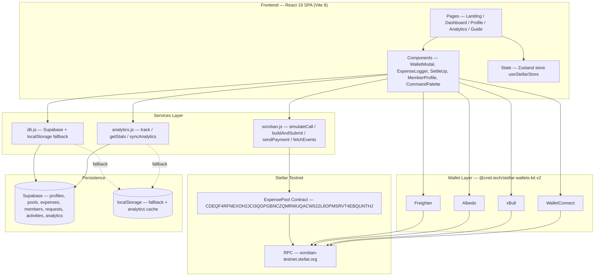
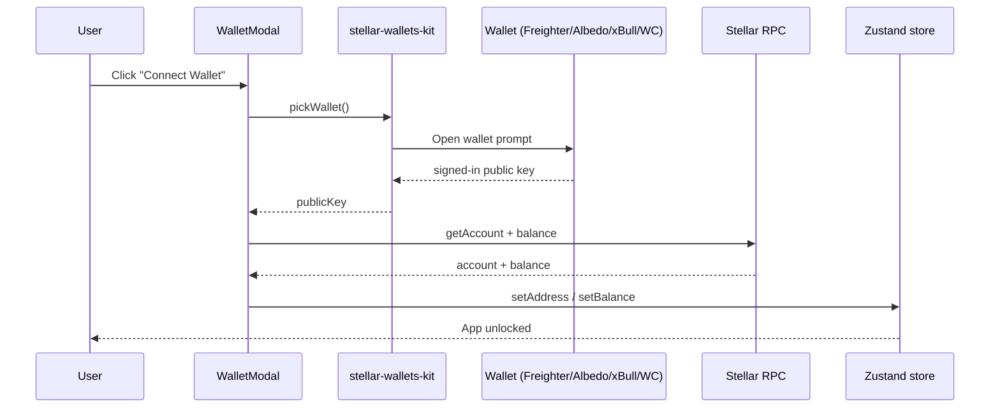
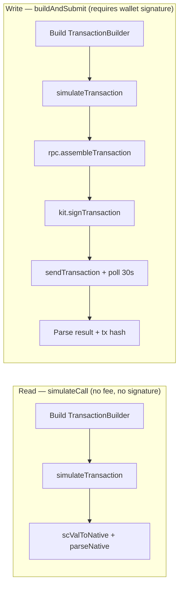
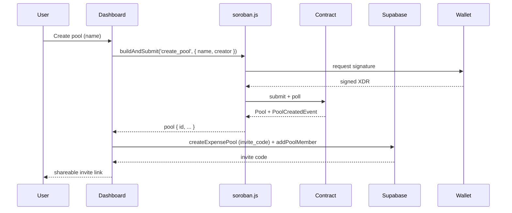
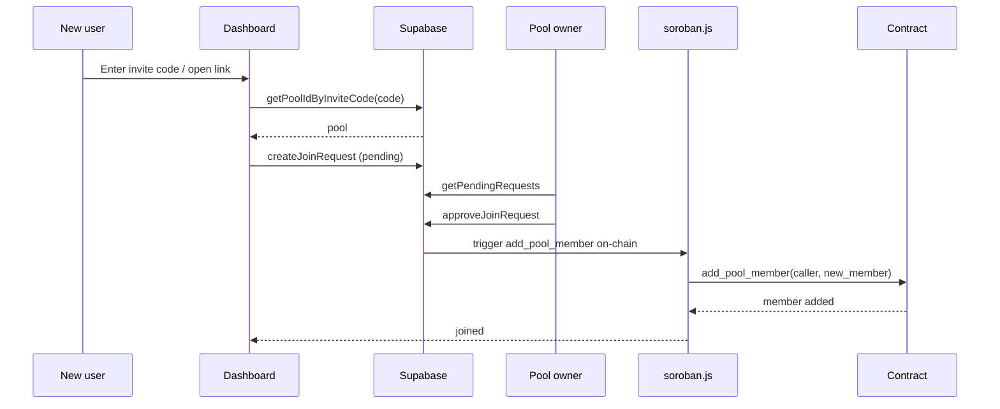
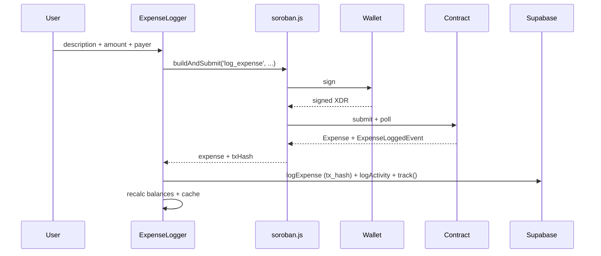
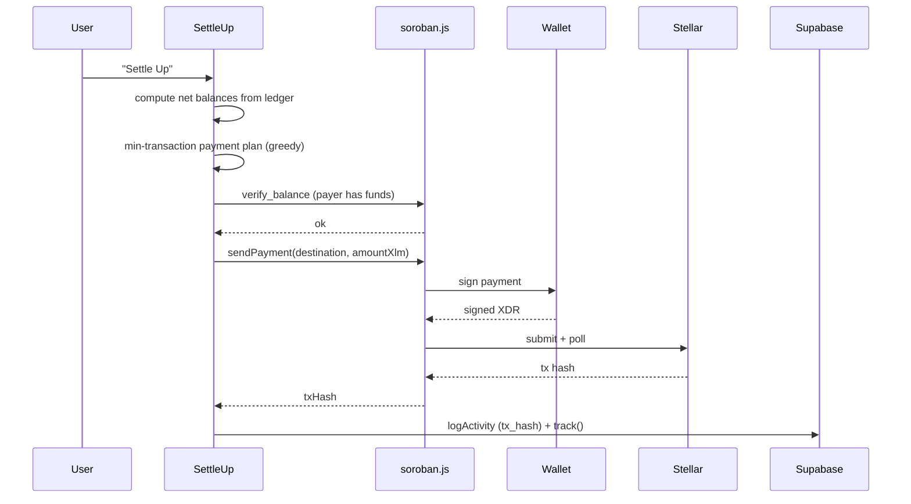
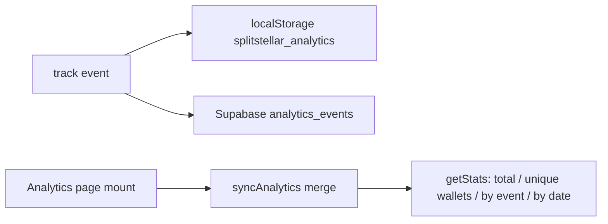
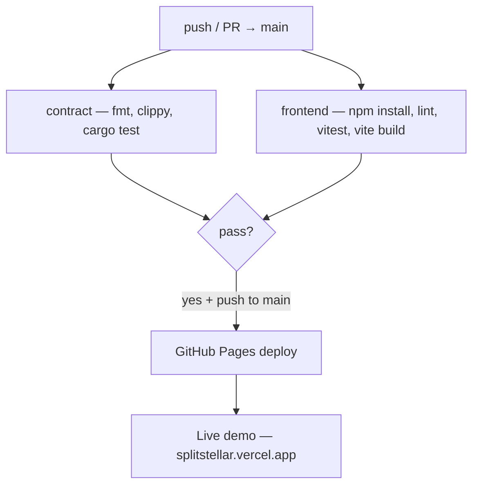

# SplitStellar — Architecture

Complete architecture, data flows, and workflows for SplitStellar: a decentralized expense-splitting dApp on the Stellar network, powered by Soroban smart contracts.

Related docs:
- [`CONTRACT_INTEGRATION.md`](./CONTRACT_INTEGRATION.md) — line-by-line contract ↔ frontend mapping
- [`FEATURE_ROADMAP.md`](./FEATURE_ROADMAP.md) — planned features
- [`README.md`](./README.md) — project overview and evidence

---

## 1. System Overview



**Stack at a glance**

| Layer | Technology |
|-------|-----------|
| Frontend | React 19, Vite 8, Tailwind CSS v4, Zustand, Framer Motion, Lenis |
| Routing | react-router-dom v7 (`/`, `/dashboard`, `/profile`, `/analytics`, `/guide`) |
| Stellar SDK | `@stellar/stellar-sdk` v16 |
| Wallet kit | `@creit.tech/stellar-wallets-kit` v2.3 (Freighter, Albedo, xBull, WalletConnect) |
| Contract | Rust `#![no_std]` Soroban contract on testnet |
| Persistence | Supabase (Postgres) with localStorage fallback |
| CI/CD | GitHub Actions (lint → test → build → deploy to GitHub Pages) |
| Hosting | Vercel (production live demo) |

---

## 2. Directory Layout

```
.
├── contracts/
│   └── expense-pool/
│       ├── Cargo.toml
│       └── src/
│           ├── lib.rs        # Soroban contract (storage, functions, events, errors)
│           └── test.rs       # 44 contract unit tests
├── frontend/
│   ├── .env.example
│   ├── index.html
│   └── src/
│       ├── main.jsx          # Entry — initializes wallet kit + router
│       ├── App.jsx           # Routes wrapped in ErrorBoundary
│       ├── index.css         # Tailwind v4 + global styles
│       ├── hooks/
│       │   └── useStellar.js # Zustand store + wallet kit bootstrap
│       ├── pages/
│       │   ├── Landing.jsx    # Explainer landing
│       │   ├── Dashboard.jsx  # Pools, create/join, ledger, members
│       │   ├── Profile.jsx    # Alias, wallet, balance, stats, activity
│       │   ├── Analytics.jsx  # Event stats + event log
│       │   └── Guide.jsx      # Step-by-step user guide
│       ├── components/
│       │   ├── Notchbar.jsx        # Nav
│       │   ├── WalletModal.jsx     # Wallet picker (desktop + mobile)
│       │   ├── ExpenseLogger.jsx   # Log-expense form
│       │   ├── SettleUp.jsx        # Settlement calculator + payment
│       │   ├── MemberProfile.jsx   # Stats + achievement badges
│       │   ├── CommandPalette.jsx  # ⌘K fuzzy search (cmdk + fuse.js)
│       │   ├── ProfileModal.jsx    # "Claim your alias" onboarding
│       │   ├── Toast.jsx / Skeleton.jsx / InitialLoader.jsx
│       │   ├── ErrorBoundary.jsx   # Per-route error fallbacks
│       │   └── SmoothScroll.jsx    # Lenis smooth scrolling
│       └── services/
│           ├── soroban.js     # On-chain reads/writes/payments/events
│           ├── db.js          # Supabase + localStorage data access
│           ├── analytics.js   # Event tracking + stats
│           ├── categories.js  # 20 expense categories with icons
│           ├── currency.js    # XLM / USDC / EURC conversion
│           ├── badges.js      # Achievement badge rules + progress
│           ├── export.js      # CSV + HTML report export (escaped)
│           ├── animations.js  # Shared Framer Motion variants
│           └── toast.js       # Toast notification system
├── scripts/
│   └── deploy.sh              # Contract build + deploy + .env update
├── .github/workflows/ci.yml   # CI/CD pipeline
├── Makefile                   # Dev/test/deploy shortcuts
└── supabase/                  # (empty) — expected table schema below
```

---

## 3. Frontend Layer

### 3.1 Routing

| Route | Page | Purpose |
|-------|------|---------|
| `/` | Landing | Explainer, feature highlights, CTA |
| `/dashboard` | Dashboard | Create/join pools, expense ledger, members, settle |
| `/profile` | Profile | Alias, wallet + balance, member stats, recent activity |
| `/analytics` | Analytics | Event totals, unique wallets, event types, event log |
| `/guide` | Guide | Step-by-step user guide |

Every route is wrapped in `ErrorBoundary` with a per-route fallback so a render error on one page never blanks the app.

### 3.2 State — `useStellarStore` (Zustand)

```js
{
  address,          // connected wallet public key
  balance,          // XLM balance (string)
  kit,              // StellarWalletsKit instance
  network,          // Networks.TESTNET
  isConnecting,
  error,
  isWalletModalOpen,
  profileName,      // claimed alias
  theme,            // 'dark' | 'light'
}
```

The store exposes setters (`setAddress`, `setBalance`, …) and actions (`toggleTheme`, `disconnect`). `initializeStellarKit()` bootstraps the wallet kit once and injects it into the store.

### 3.3 Services

**`soroban.js` — on-chain access layer.** All Stellar interactions flow through this module:
- `getServer()` / `getContract()` — lazy singletons for the RPC server and contract.
- `simulateCall(publicKey, method, args)` — **read path** (see §7): build tx → simulate → `scValToNative` → `parseNative`.
- `buildAndSubmit(publicKey, kit, method, args)` — **write path**: build → simulate → `assembleTransaction` → `kit.signTransaction` → submit → poll → parse.
- `sendPayment(publicKey, kit, destination, amountXlm)` — native XLM payment for settlement.
- `fetchEvents(publicKey, cursor)` + `convertEventTopics()` — reads contract events (limit 50, cursor-paginated) for the on-chain ledger.
- `pollTransaction()` — polls `getTransaction` every 1s until success/failure (30s timeout).
- `toScVal()` / `parseNative()` — ScVal ↔ JS conversions for every contract method.

**`db.js` — persistence layer.** Two backends behind one interface:
- **Supabase** when `VITE_SUPABASE_URL` is set.
- **localStorage** fallback (`mock_db_<table>`) when Supabase is not configured or tables return 404 (`PGRST116`).
- Adds onboarding features the contract does not own: invite codes, join requests/approval, activity log, alias profiles, cached expenses.

**`analytics.js` — product analytics.** Writes events to localStorage (`splitstellar_analytics`, capped at 500) and mirrors them to the `analytics_events` Supabase table. `getStats()` computes total events, unique wallets, per-event breakdown, per-day breakdown. `syncAnalytics()` merges remote events back into local storage.

**Supporting services** — `categories.js` (20 preset categories with icons/colors), `currency.js` (XLM/USDC/EURC stroop math), `badges.js` (15 achievement rules + progress), `export.js` (CSV/HTML reports with XSS + CSV-injection escaping), `toast.js`, `animations.js`.

---

## 4. Wallet Integration

`@creit.tech/stellar-wallets-kit` v2.3 registers four modules:

| Module | Registered when | Notes |
|--------|----------------|-------|
| `FreighterModule` | always | Browser extension |
| `AlbedoModule` | always | Browser/web (works on mobile) |
| `xBullModule` | always | Browser extension |
| `WalletConnectModule` | `VITE_WALLETCONNECT_PROJECT_ID` set | Mobile wallet pairing; `allowedChains: ['stellar:testnet']` |

The kit is initialized once (`initializeStellarKit`) with `network: TESTNET` and injected into the Zustand store. The `WalletModal` decides which wallets to show and hides mobile-unavailable extensions on phones.



---

## 5. Smart Contract (`contracts/expense-pool`)

### 5.1 Storage model

`#![no_std]` Soroban contract using persistent storage:

| `DataKey` | Value |
|-----------|-------|
| `PoolCount` | `u64` — running pool counter |
| `Pool(u64)` | `Pool { id, name, creator, total_expenses, created_at, member_count, is_active }` |
| `Expense(pool_id, index)` | `Expense { pool_id, id, description, amount, payer, split_among, created_at, settled }` — individual entries, O(1) writes |
| `ExpenseCount(u64)` | `u64` — running expense counter per pool |
| `PoolMembers(u64)` | `Vec<Address>` — member list per pool |
| `Member(u64, Address)` | `bool` — fast membership lookup |
| `Settlement(pool_id, index)` | `SettlementRecord { pool_id, id, from, to, amount, timestamp }` |
| `SettlementCount(u64)` | `u64` — running settlement counter per pool |

Constants: `MAX_POOL_NAME_LEN = 64`, `MAX_DESCRIPTION_LEN = 128`, `MAX_EXPENSES_PER_POOL = 1000`, `DEFAULT_PAGE_SIZE = 50`, `MAX_PAGE_SIZE = 100`, `MAX_SETTLEMENTS = 500`.

### 5.2 Contract functions

| Function | Signature | Auth |
|----------|-----------|------|
| `create_pool` | `(env, name, creator) -> Result<Pool>` | `creator.require_auth()` |
| `get_pool` | `(env, pool_id) -> Result<Pool>` | read |
| `is_pool_member` | `(env, pool_id, member) -> bool` | read |
| `add_pool_member` | `(env, pool_id, caller, new_member) -> Result<()>` | `caller.require_auth()` + creator-only |
| `get_pool_members` | `(env, pool_id) -> Result<Vec<Address>>` | read |
| `log_expense` | `(env, pool_id, description, amount, payer) -> Result<Expense>` | `payer.require_auth()` + member check |
| `verify_balance` | `(env, token_id, owner, required) -> Result<bool>` | cross-contract |
| `get_pool_expenses` | `(env, pool_id, offset, limit) -> Result<Vec<Expense>>` | read (paginated) |
| `get_expense` | `(env, pool_id, expense_id) -> Result<Expense>` | read |
| `record_settlement` | `(env, pool_id, from, to, amount, caller) -> Result<SettlementRecord>` | `caller.require_auth()` + member check |
| `get_pool_settlements` | `(env, pool_id, offset, limit) -> Result<Vec<SettlementRecord>>` | read (paginated) |
| `archive_pool` | `(env, pool_id, caller) -> Result<()>` | `caller.require_auth()` + creator-only |
| `update_pool_name` | `(env, pool_id, new_name, caller) -> Result<()>` | `caller.require_auth()` + creator-only |

### 5.3 Events

- `PoolCreatedEvent { pool_id, name, creator }`
- `MemberAddedEvent { pool_id, member }`
- `ExpenseLoggedEvent { expense_id, pool_id, description, amount, payer }`
- `SettlementRecordedEvent { settlement_id, pool_id, from, to, amount }`
- `PoolArchivedEvent { pool_id }`
- `PoolUpdatedEvent { pool_id, new_name }`

Consumed by `fetchEvents()` for the live on-chain ledger.

### 5.4 Errors

15 typed errors: `PoolNotFound`, `NotPoolCreator`, `InsufficientBalance`, `AmountZero`, `NotPoolMember`, `PoolNameTooLong`, `DescriptionTooLong`, `PoolFull`, `Unauthorized`, `PoolArchived`, `AlreadyMember`, `InvalidPagination`, `SettlementsFull`, `MembersFull`, `ExpenseNotFound`.

### 5.5 Inter-contract calls

`TokenClient::balance` invokes a Stellar token contract (`balance`) to verify a payer holds sufficient funds before `verify_balance` returns.

---

## 6. Persistence & Data Model

Supabase tables (created externally; schema is referenced in `db.js`):

| Table | Purpose |
|-------|---------|
| `profiles` | Wallet alias mapping (`wallet_address`, `name`) |
| `expense_pools` | Off-chain pool metadata + `invite_code`, `created_by` |
| `expenses` | Expense records with `tx_hash` from the on-chain write |
| `pool_members` | Membership join table |
| `join_requests` | Pending owner approvals (`pending`/`approved`/`rejected`) |
| `activities` | Per-user activity feed (profile page) |
| `analytics_events` | Mirrored analytics events |

**Fallback design:** every `db.js` call runs `withFallback(fn, fallback)` — if Supabase is unconfigured or a table returns 404, the call transparently reads/writes localStorage. This keeps the app fully functional without a backend during development.

---

## 7. On-Chain Read vs Write Patterns



**Why two paths:** reads are free simulations that never leave the RPC; writes require building a Soroban invocation, simulating to get the auth/preflight footprint, assembling the fee-bumped envelope, having the user sign in their wallet, then submitting and polling for inclusion.

---

## 8. Key Workflows

### 8.1 Create a pool



### 8.2 Invite & join (with owner approval)



> Note: approval also inserts into `pool_members` (Supabase) so `getUserPoolIds` and the dashboard "your pools" list resolve without on-chain scans.

### 8.3 Log an expense (on-chain)



### 8.4 Settle up (XLM payment)



### 8.5 Analytics pipeline



---

## 9. Security Model

- **Contract-level auth** — `require_auth()` on `create_pool`, `add_pool_member`, `log_expense`, `record_settlement`, `archive_pool`, `update_pool_name`; only members can log, only the creator adds members/archives/updates.
- **Invite-code gating** — 8-char codes (`ABCDEFGHJKLMNPQRSTUVWXYZ23456789`); joining requires owner approval.
- **Input validation** — pool names ≤64, descriptions ≤128, amounts > 0 and ≤ 1B XLM, max 1000 expenses/pool, max 500 settlements/pool.
- **XSS / CSV-injection** — user input sanitized; exported CSV/HTML escapes `= + - @` and HTML entities.
- **Balance checks** — `verify_balance` invokes the token contract before settlement.
- **Pool lifecycle** — `archive_pool` prevents further expenses; `update_pool_name` allows creator renaming.

---

## 10. CI/CD & Deployment

`.github/workflows/ci.yml` — three jobs on push/PR to `main`:



**Contract job** — `cargo fmt --check`, `cargo clippy -D warnings`, `cargo test` (44 tests), with Cargo caching.

**Frontend job** — `npm install --legacy-peer-deps`, `eslint`, `vitest run` (13 tests), `vite build` (env injected via GitHub vars with defaults), artifact upload.

**Deploy job** — uploads `dist` to GitHub Pages. The production live demo is hosted at **splitstellar.vercel.app**.

**Manual contract deploy** — `./scripts/deploy.sh testnet|mainnet` builds the WASM, deploys via `stellar contract deploy`, and writes the new contract ID into `frontend/.env`.

---

## 11. Testing Strategy

| Layer | Tooling | Coverage |
|-------|---------|----------|
| Contract | `cargo test` | 44 unit tests in `test.rs` (create, membership, expenses, validation, errors, settlements, archival, pagination) |
| Frontend services | Vitest + jsdom | 13 tests (`db.test.js`, `toast.test.js`) |
| Lint | ESLint (flat config) | full `src/` |
| Build gate | `vite build` | production bundle + contract env |

Run everything: `make test` (contract + frontend), `npm run lint`, `npx vite build`.

---

## 12. Configuration

Environment variables (see `frontend/.env.example`):

| Variable | Purpose |
|----------|---------|
| `VITE_SOROBAN_CONTRACT_ID` | Deployed contract address |
| `VITE_SOROBAN_RPC_URL` | RPC endpoint (defaults to testnet) |
| `VITE_STELLAR_NETWORK` | `testnet` |
| `VITE_SUPABASE_URL` / `VITE_SUPABASE_ANON_KEY` | Optional — localStorage fallback when absent |
| `VITE_WALLETCONNECT_PROJECT_ID` | Enables WalletConnect module on mobile |

`make setup` copies `.env.example`, builds the contract, and installs frontend deps.
