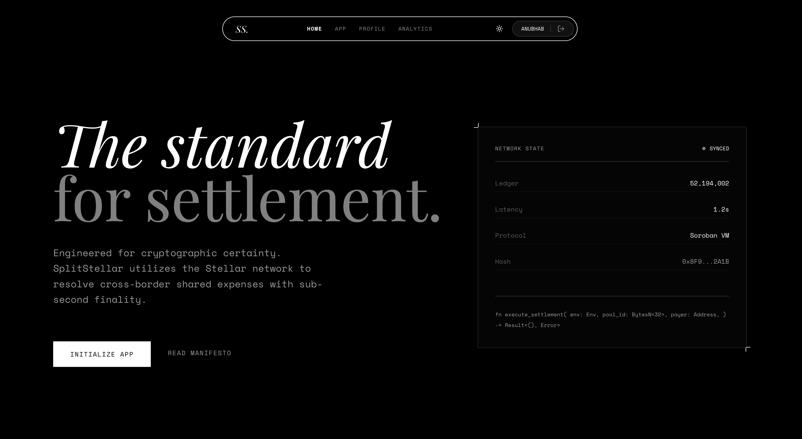
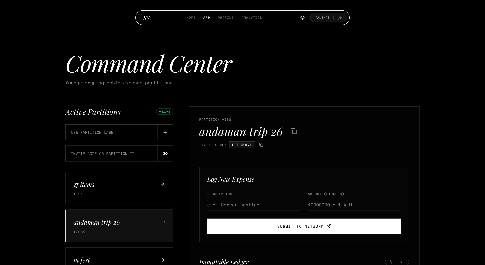
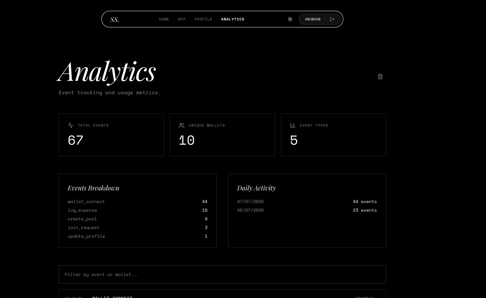

# SplitStellar

Decentralized expense splitting on the Stellar network powered by Soroban smart contracts. Create expense pools, log transactions on-chain, and track settlements — all directly from your wallet.

**Live demo:** [splitstellar.vercel.app](https://splitstellar.vercel.app/)

**Youtube Link:** [View here](https://youtu.be/1UexAQg4Rbw)

---

## Tech Stack


---

## Screenshots

### Desktop





### Analytics Dashboard



---

## Project Structure

```
stellar-project/
├── contracts/
│   └── expense-pool/              # Soroban smart contract (Rust)
│       └── src/
│           ├── lib.rs              # 6 exported functions + contract events
│           └── test.rs             # 14 unit tests
├── frontend/
│   └── src/
│       ├── components/             # WalletModal, ExpenseLogger, Toast, etc.
│       ├── hooks/                  # useStellar (Zustand store + wallet kit)
│       ├── pages/                  # Landing, Dashboard, Profile
│       └── services/               # SorobanRPC client, Toast, DB
├── scripts/
│   └── deploy.sh                   # Contract deployment (testnet/mainnet)
├── .github/workflows/ci.yml        # CI/CD pipeline
└── vercel.json                     # Vercel deployment config
```

---

## Smart Contract

**Deployed on Testnet:** [`CAG5MXEQORC4ZP57WI4WJVXWHP5CZHXXMA77VV63JVSW42GNMJYAMUCJ`](https://stellar.expert/explorer/testnet/contract/CAG5MXEQORC4ZP57WI4WJVXWHP5CZHXXMA77VV63JVSW42GNMJYAMUCJ)

> **Integration mapping:** See [`CONTRACT_INTEGRATION.md`](./CONTRACT_INTEGRATION.md) for the complete function-by-function mapping between contract (`lib.rs`) and frontend (`soroban.js`), including ScVal type alignment, parameter names, parser logic, event definitions, and file references.

### Functions

| Function | Contract (`lib.rs`) | ScVal Mapping (`soroban.js`) | Frontend Call | Parser |
|----------|--------------------|------------------------------|---------------|--------|
| `create_pool(name, creator)` | `lib.rs:84 → Pool` | `toScVal` line 45 | `buildAndSubmit(address, kit, 'create_pool', ...)` | `parseNative` line 77 |
| `get_pool(pool_id)` | `lib.rs:119 → Option<Pool>` | `toScVal` line 57 | `simulateCall(address, 'get_pool', ...)` | `parseNative` line 77 |
| `log_expense(pool_id, desc, amount, payer)` | `lib.rs:124 → Result<Expense>` | `toScVal` line 50 | `buildAndSubmit(address, kit, 'log_expense', ...)` | `parseNative` line 108 |
| `get_pool_expenses(pool_id)` | `lib.rs:199 → Vec<Expense>` | `toScVal` line 57 | `simulateCall(address, 'get_pool_expenses', ...)` | `parseNative` line 88 |
| `get_expense(expense_id)` | `lib.rs:207 → Option<Expense>` | `toScVal` line 60 | `simulateCall(address, 'get_expense', ...)` | `parseNative` line 97 |
| `verify_balance(token_id, owner, required)` | `lib.rs:184 → Result<bool>` | `toScVal` line 62 | `simulateCall(address, 'verify_balance', ...)` | — |

> **Parameter alignment:** Contract `u64` → JS `BigInt()`, `String` → JS `string`, `Address` → JS `string`, `i128` → JS `BigInt()`. See [`CONTRACT_INTEGRATION.md`](./CONTRACT_INTEGRATION.md#parameter-type-alignment) for full type mapping.

### Error Codes

| Code | Error |
|------|-------|
| 1 | `PoolNotFound` |
| 2 | `NotPoolCreator` |
| 3 | `InsufficientBalance` |
| 4 | `AmountZero` |

### Inter-Contract Communication

`verify_balance` calls the standard Stellar token interface (`balance` entry point) to verify an address holds sufficient tokens — demonstrating cross-contract invocation on Soroban.

---

## Onboarded Wallets (Testnet)

11 unique Stellar wallets interacted with the app during Level 4 testing:

```
GAG7BIU5EL7KOBVVM4HFD5NOZVIKUT7JK3WYLUGVYMYTJOIST3K27ZJ7
GA72JHQ5C3JDZ3H5RVUNYZ6GGXJWN6V6NHSXU2OJY7JJ2GF3IC5MIFUY
GB2GLZJEOFZXGK3OJTD25B2XOZNP7GLIPKXNJKQ7FC66LIWTHJTHN6EB
GBRZI47KWUCFX64IRERZOWKKMZ5WSKBAPSZ2VVN3DLMTUQIUA6RBA3YX
GBPIWK56OE3Z7Q4ZZCHHWRTGKXWA2IOV3DK2HCEAVW53PITZRVZLC7VJ
GDGZUKLVW5X3U6U4I3JIJLQMJJRAGGDGR3AUYUUYEM2W7OJFV7EIRZXN
GCJ2RC2HZN4D232SFJMLFBUJEZWB6OYCIFAZG6SCYUQP5Z5LB2RG4YEP
GDA7V5EKSYXDO5URT7FQSFQJCLDV3YR4SUXMXCYZ7UWAISAPEVGSCB23
GD4BOUGXDFVYJMT6X6KFGCFRSMPNDSU3W6UGYS22AVZAWCOBVDXOVDFL
GCG34N562IX57PLLVKVC6LYQEK7VNX3HBR5KIECNT22MR5P7MOHN7ECW
GBGEJTLNY3A4BMZGFAWFVVBJZOZLFCLD6Y2FROAYVN26R2EPEJZA7ADF
```

## Example Transaction Hashes

Verified on-chain transactions from real usage during testing:

| # | Tx Hash | Explorer |
|---|---------|----------|
| 1 | `24f5270cc06e1bd2627b68a8d2d7dbb0a6e8a7e139dbd119ff7d86c2fb2d17b3` | [View](https://stellar.expert/explorer/testnet/tx/24f5270cc06e1bd2627b68a8d2d7dbb0a6e8a7e139dbd119ff7d86c2fb2d17b3) |
| 2 | `f3dd06701e9abb9f2ff4d5d1b38939e2a4ea54d8522c6b73a5c0a5740882073e` | [View](https://stellar.expert/explorer/testnet/tx/f3dd06701e9abb9f2ff4d5d1b38939e2a4ea54d8522c6b73a5c0a5740882073e) |
| 3 | `f46b38406cffa5835df9577051432f69bbaf56c814a8643cb95058d008ae377d` | [View](https://stellar.expert/explorer/testnet/tx/f46b38406cffa5835df9577051432f69bbaf56c814a8643cb95058d008ae377d) |
| 4 | `959b790bf32a027c081388b7b48b0b4c88a6752e403f66475e81e9811d6c281b` | [View](https://stellar.expert/explorer/testnet/tx/959b790bf32a027c081388b7b48b0b4c88a6752e403f66475e81e9811d6c281b) |
| 5 | `ae094e905aa49d17d62dbada3026d06a0cf4c3575b7ac9ef6daea1334d40cde7` | [View](https://stellar.expert/explorer/testnet/tx/ae094e905aa49d17d62dbada3026d06a0cf4c3575b7ac9ef6daea1334d40cde7) |
| 6 | `5011d841e1999c38dd8cef99f1583aa8b39e77af1eaed192f2adbdc77644f75c` | [View](https://stellar.expert/explorer/testnet/tx/5011d841e1999c38dd8cef99f1583aa8b39e77af1eaed192f2adbdc77644f75c) |

---

## Feedback

- **Google Form:** [Submit feedback](https://forms.gle/2gjEdehQZsiQ1GqY9)
- **Response Spreadsheet:** [View responses](https://docs.google.com/spreadsheets/d/1k7NOD86ff6VQdbosQo0M5DkEAmExZouflWb0qGyLkRA/edit?usp=sharing)

### User Feedback Summary

> **Security & Access Control** — Testers flagged that random pool IDs were guessable and anyone could join without confirmation. **Addressed**: invite-code-gated access + owner approval system implemented; `?pool=ID` links no longer auto-join non-members.
>
> **Notifications** — Multiple users requested real-time alerts when expenses are added. Flagged for future work.
>
> **Dark / Light Theme** — Several users praised the dark/white theme toggle. Already supported.
>
> **Expense Tagging** — Request for categorizing/tagging expenses. Flagged for future work.
>
> **Gamification** — Suggestion to make the experience more game-like. Flagged for future work.
>
> **UI/UX** — Overall positive feedback on the interface design and usability.

---

## Running Locally

```bash
# Clone and install
git clone https://github.com/Anubhab-Rakshit/splitstellar.git
make setup

# Start dev server
make dev

# Run all tests
make test
```

### Prerequisites

- Node.js 22+
- Rust (stable) with `wasm32v1-none` target
- [Stellar CLI](https://developers.stellar.org/docs/tools/cli) v27+
- Freighter browser extension (for wallet interaction)

### Environment

Copy `.env.example` to `frontend/.env`:

```env
VITE_SOROBAN_CONTRACT_ID=CAG5MXEQORC4ZP57WI4WJVXWHP5CZHXXMA77VV63JVSW42GNMJYAMUCJ
VITE_SOROBAN_RPC_URL=https://soroban-testnet.stellar.org
VITE_STELLAR_NETWORK=testnet
VITE_SUPABASE_URL=              # optional — falls back to localStorage
VITE_SUPABASE_ANON_KEY=         # optional
```

---

## Testing

```bash
# Contract (Rust) — 14 tests
cd contracts/expense-pool && cargo test

# Frontend (Vitest) — 13 tests
cd frontend && npx vitest run

# All at once
make test
```

---

## Deployment

### Contract

```bash
# Testnet (default)
./scripts/deploy.sh

# Mainnet
./scripts/deploy.sh mainnet
```

### Frontend

Auto-deployed to [Vercel](https://vercel.com) via GitHub integration. Every push to `main` triggers build and deploy.

### CI/CD Pipeline

GitHub Actions workflow (`.github/workflows/ci.yml`):

1. **Contract** — `cargo fmt --check`, `cargo clippy`, `cargo test`
2. **Frontend** — `eslint`, `vitest run`, `vite build`
3. **Deploy** — to Vercel on `main` push

---

## Architecture

```
┌──────────┐     ┌──────────────┐     ┌──────────────┐
│  Browser │◄───►│  Vite + React │◄───►│ Soroban RPC  │
│ (Wallet) │     │  (Vercel)    │     │  (Testnet)   │
└──────────┘     └──────┬───────┘     └──────┬────────┘
                        │                    │
                        ▼                    ▼
                 ┌────────────┐     ┌──────────────┐
                 │  Supabase  │     │  Soroban     │
                 │ (Profiles, │     │  Contract    │
                 │  Activity) │     │  (Rust)      │
                 └────────────┘     └──────────────┘
```

- **Frontend** — React SPA with Zustand state, Tailwind CSS, Framer Motion
- **Wallet** — Freighter / Albedo / xBull via `@creit.tech/stellar-wallets-kit`
- **Contract** — Rust Soroban smart contract deployed on testnet (6 functions, 2 events)
- **Integration** — `@stellar/stellar-sdk` v16 (`Contract`, `nativeToScVal`, `rpc.Server`, `TransactionBuilder`). Reads via `simulateCall`, writes via `buildAndSubmit` (simulate → assemble → sign → submit → poll). Full mapping in [`CONTRACT_INTEGRATION.md`](./CONTRACT_INTEGRATION.md)
- **Events** — Real-time polling (8–10s intervals) for pool discovery
- **Persistence** — Pool IDs in `localStorage`, profiles/activity in Supabase
- **CI/CD** — GitHub Actions → lint, test, build → Vercel deploy

---

Built with ❤️ for the Stellar ecosystem.
