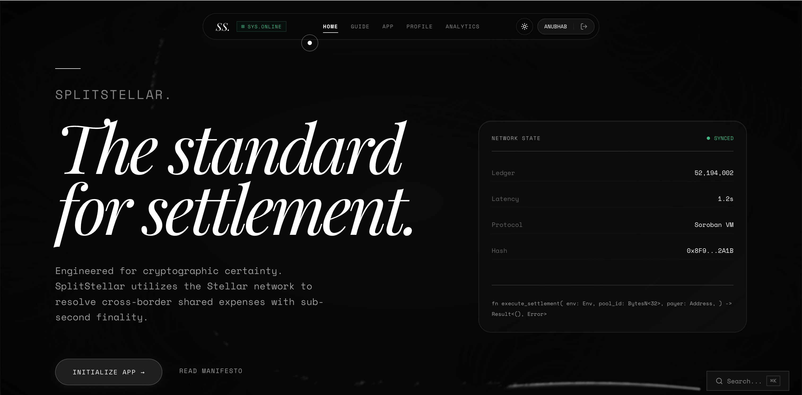
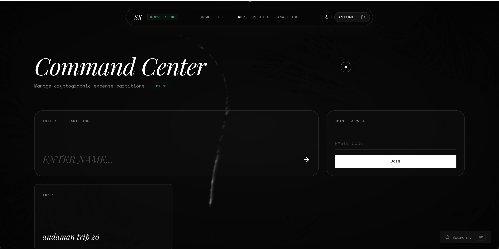
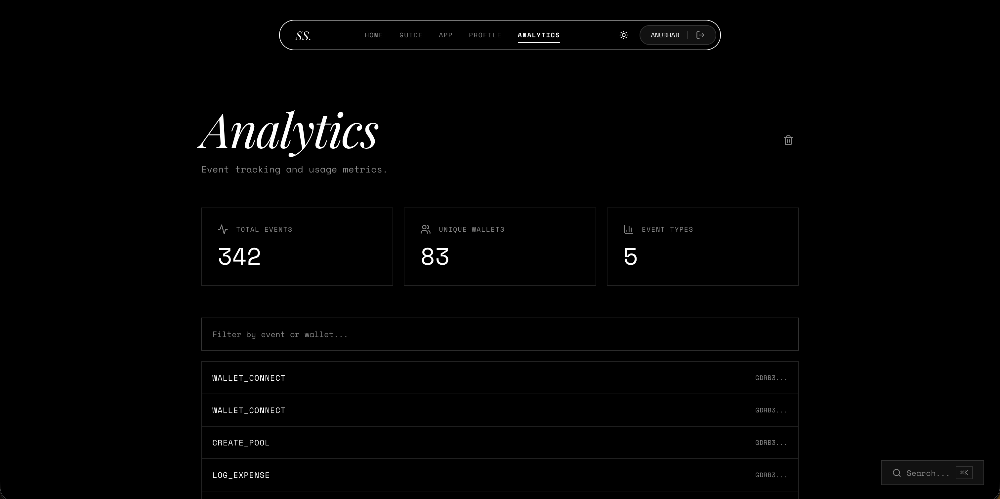
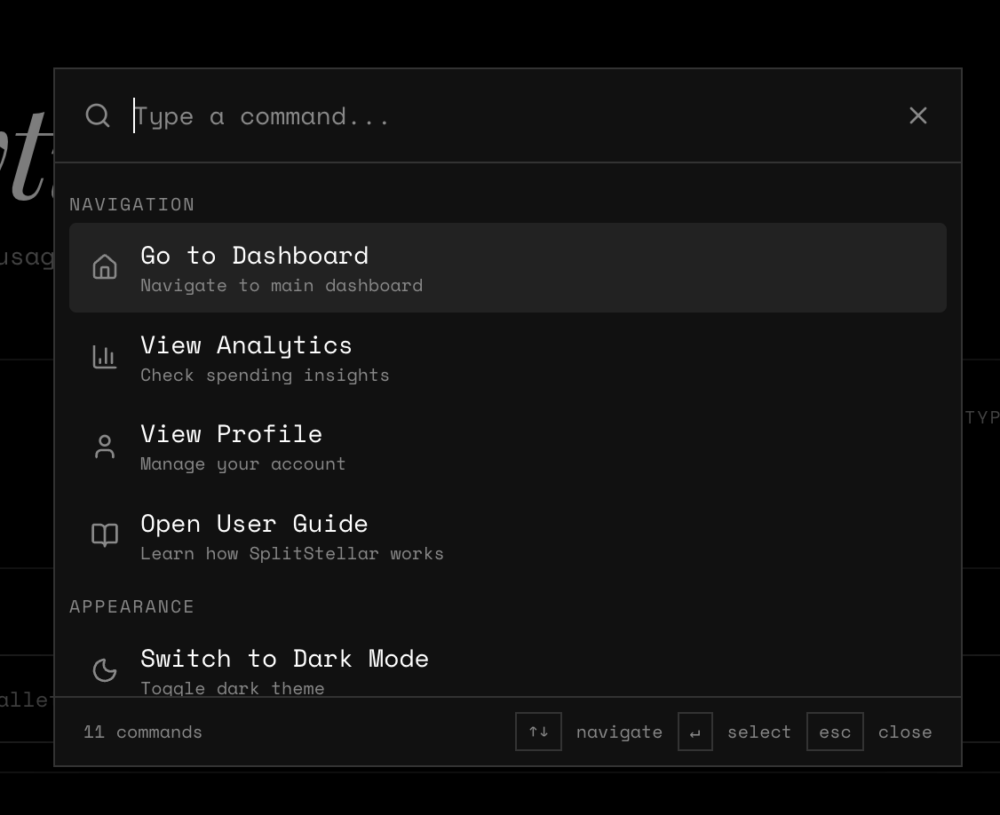
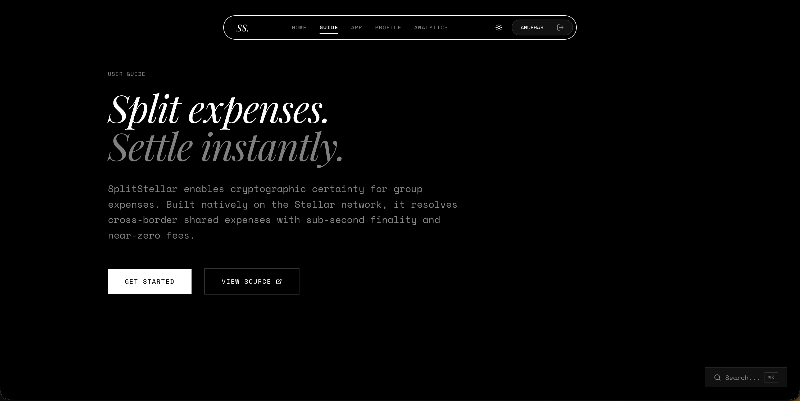
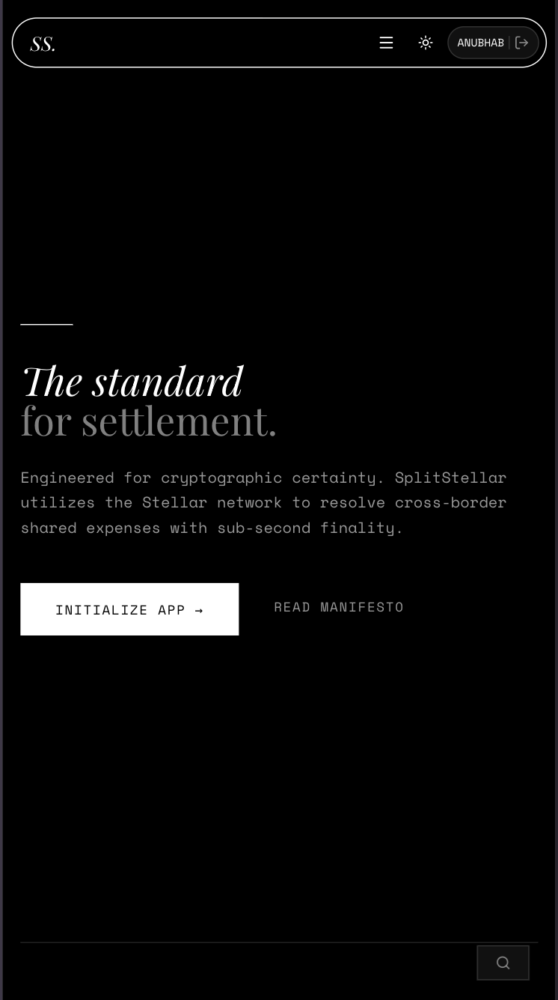
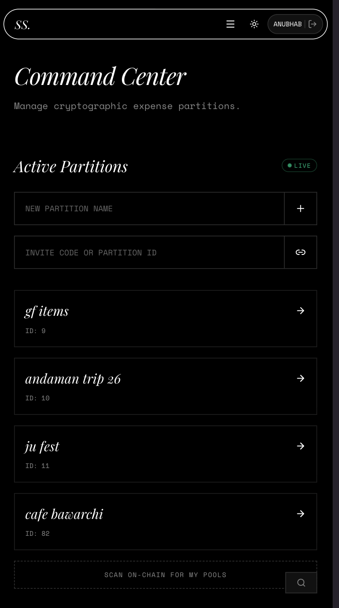

# SplitStellar

[](https://github.com/Anubhab-Rakshit/splitstellar/actions/workflows/ci.yml)

Decentralized expense splitting on the Stellar network powered by Soroban smart contracts. Create expense pools, log transactions on-chain, and settle balances — all directly from your wallet.

- **Live demo:** [splitstellar.vercel.app](https://splitstellar.vercel.app/)
- **Demo video:** [Watch on YouTube](https://youtu.be/Txo6T-UR3vo)
- **User guide:** [splitstellar.vercel.app/guide](https://splitstellar.vercel.app/guide)
- **Testnet contract:** [`CAMFEWTNBPLGOWA5P3TD2GVEGDNE6G4TUVFRNWSZN67ZWNTBBNNUYG25`](https://stellar.expert/explorer/testnet/contract/CAMFEWTNBPLGOWA5P3TD2GVEGDNE6G4TUVFRNWSZN67ZWNTBBNNUYG25)
- **Integration map:** [`CONTRACT_INTEGRATION.md`](./CONTRACT_INTEGRATION.md)
- **User data:** [Google Sheets](https://docs.google.com/spreadsheets/d/1k7NOD86ff6VQdbosQo0M5DkEAmExZouflWb0qGyLkRA/edit?usp=sharing)
- **Feedback form:** [Google Form](https://forms.gle/2gjEdehQZsiQ1GqY9)
- **Presentation deck:** [Google Drive (PDF)](https://drive.google.com/drive/folders/18ymk8qxpR95uYYyXeDYsOXN_FPp9e1dF?usp=drive_link)

## Quick navigation

- [Screenshots](#screenshots)
- [Level 4 evidence](#level-4--evidence)
- [Level 5 — 50+ user proof](#level-5--user-growth-and-feedback)
- [Verified transactions](#verified-transactions-level-5)
- [Feedback → improvements → commits](#feedback--improvements--commits)
- [Recent features](#recent-features)
- [Smart contract](#smart-contract)
- [Workflows](#workflows)
- [Getting started](#getting-started)
- [Submission checklist](#submission-checklist)

## Tech Stack


## Screenshots

### Desktop

#### Landing



#### Command Centre



#### Analytics



#### Navigation



#### User Guide



### Mobile

<div style="display:flex; gap:12px; justify-content:center;">
  
  
  
</div>

---

## Level 4 — Evidence

The Level 4 milestone delivered the full product loop: Soroban contract, wallet integration, pool sharing, on-chain settlement, and mobile responsiveness.

### Key commits

| Commit | Description |
|--------|-------------|
| [`f2f0a0b`](https://github.com/Anubhab-Rakshit/splitstellar/commit/f2f0a0b) | Pool sharing, join by ID, shareable URLs, Settle Up with on-chain XLM settlement |
| [`249008b`](https://github.com/Anubhab-Rakshit/splitstellar/commit/249008b) | Analytics enabled and mobile responsiveness polished |
| [`b400f5b`](https://github.com/Anubhab-Rakshit/splitstellar/commit/b400f5b) | Securities enhanced for pools |
| [`c230238`](https://github.com/Anubhab-Rakshit/splitstellar/commit/c230238) | Security breaches fixed — pools can no longer be intervened |
| [`d0f94c1`](https://github.com/Anubhab-Rakshit/splitstellar/commit/d0f94c1) | Added screenshots, updated README, fixed UI/UX errors |
| [`45ba042`](https://github.com/Anubhab-Rakshit/splitstellar/commit/45ba042) | Light mode errors fixed |

### Onboarded wallets (11 during Level 4 testing)

```
GAG7BIU5EL7KOBVVM4HFD5NOZVIKUT7JK3WYLUGVYMYTJOIST3K27ZJ7
GA72JHQ5C3JDZ3H5RVUNYZ6GGXJWN6V6NHSXU2OJY7JJ2GF3IC5MIFUY
GB2GLZJEOFZXGK3OJTD25B2XOZNP7GLIPKXNJKQ7FC66LIWTHJTHN6EB
GBRZI47KWUCFX64IRERZOWKKMZ5WSKBAPSZ2VVN3DLMTUQIUA6RBA3YX
GBPIWK56OE3Z7Q4ZZCHHWRTGKXWA2IOV3DK2HCEAVW53PITZRVZLC7VJ
GDGZUKLVW5X3U6U4I3JIJLQMJJRAGGDGR3AUYUUYEM2W7OJFV7EIRZXN
GCJ2RC2HZN4D232SFJMLFBUJEZWB6OYCIFAZG6SCYUQP5Z5LB2RG4YEP
GDA7V5EKSYXDO5URT7FQSFQJCLDV3YR4SUXMXCYZ7UWAISAPEVGSCB23
GD4BOUGXDFVYJMT6X6KFGCFRSMPNDSU3W6UGYS22AVZAWCOBVDXOVDFL
GCG34N562IX57PLLVKVC6LYQEK7VNX3HBR5KIECNT22MR5P7MOHN7ECW
GBGEJTLNY3A4BMZGFAWFVVBJZOZLFCLD6Y2FROAYVN26R2EPEJZA7ADF
```

### Example transaction hashes (verified on-chain)

| # | Tx Hash | Explorer |
|---|---------|----------|
| 1 | `24f5270cc06e1bd2627b68a8d2d7dbb0a6e8a7e139dbd119ff7d86c2fb2d17b3` | [View](https://stellar.expert/explorer/testnet/tx/24f5270cc06e1bd2627b68a8d2d7dbb0a6e8a7e139dbd119ff7d86c2fb2d17b3) |
| 2 | `f3dd06701e9abb9f2ff4d5d1b38939e2a4ea54d8522c6b73a5c0a5740882073e` | [View](https://stellar.expert/explorer/testnet/tx/f3dd06701e9abb9f2ff4d5d1b38939e2a4ea54d8522c6b73a5c0a5740882073e) |
| 3 | `f46b38406cffa5835df9577051432f69bbaf56c814a8643cb95058d008ae377d` | [View](https://stellar.expert/explorer/testnet/tx/f46b38406cffa5835df9577051432f69bbaf56c814a8643cb95058d008ae377d) |
| 4 | `959b790bf32a027c081388b7b48b0b4c88a6752e403f66475e81e9811d6c281b` | [View](https://stellar.expert/explorer/testnet/tx/959b790bf32a027c081388b7b48b0b4c88a6752e403f66475e81e9811d6c281b) |
| 5 | `ae094e905aa49d17d62dbada3026d06a0cf4c3575b7ac9ef6daea1334d40cde7` | [View](https://stellar.expert/explorer/testnet/tx/ae094e905aa49d17d62dbada3026d06a0cf4c3575b7ac9ef6daea1334d40cde7) |
| 6 | `5011d841e1999c38dd8cef99f1583aa8b39e77af1eaed192f2adbdc77644f75c` | [View](https://stellar.expert/explorer/testnet/tx/5011d841e1999c38dd8cef99f1583aa8b39e77af1eaed192f2adbdc77644f75c) |

---

## Level 5 — User growth and feedback

**53 responses** collected via the [Google Form](https://forms.gle/2gjEdehQZsiQ1GqY9) with an **average product rating of 8.6/10** (13×10, 17×9, 14×8, 8×7, 1×6). **All 53** testers connected their Stellar wallet and submitted a unique, verified wallet address (53/53 unique, all 56-char testnet keys) after completing the full testing flow. Email addresses are withheld from this public list for privacy.

| Name | Wallet Address | Rating |
|------|----------------|--------|
| Prajit Bakshi | `GDCRU2LQGDNQNYIVQF4XWPIR3A5ZVVKYL5QHRMQNTCPHO6WER3VV5BU5` | 9 |
| Arin Das | `GDT46JCCBAOVYY6QDJIJOCHCVDEHMPYRIDQODNBBGFLIKVEOI5BIN7QH` | 9 |
| Mukta Das | `GCQQ66RJG7KKMI6DOJ543OKAAHMVL7FH4EBNEHCZRFAKQGJEXROWVHJB` | 8 |
| Vibhan Dutta | `GC5HT6TIRRM4AXLS4FLWEEWWAGXFEWASKNVNQHHEE5MYXAGTVAGOEX4B` | 7 |
| Anantajit Das | `GC6URYNTLGARSFS42EB7KQBKSIX7YT2ZJITHN6MZIF3MBJ4JVZPK6VCD` | 9 |
| SOHANA Ghosh | `GCOYVBZZA6ELZYSHMJ5WKOKMV464E2G72SD2CHIBQSYCEFH6O4DGQ42W` | 9 |
| Subham Bhat | `GDQKOGWV7J3MFLXT3HJUQRHPXFCHKZIVVG6HB556WOLBPRVGSQZQM2EP` | 9 |
| Abhiraj Bhowmick | `GBUMKN5CXHAFJKWBTAKCAULDYHPGRG6G6SY2A57HT5CKBMGORERCSENL` | 8 |
| Ayanika Sen | `GDUIWWJMR7G2F6YPGUB6UDPUTFKPAATPGZA5OW4MG47VTKNUXPQUOSDQ` | 8 |
| Sampad | `GAJXENCVGEH6JZ6WSD6NAOARUKHQ6RTGAKMINWUS7HNEXX7SWN3TIAMW` | 7 |
| Oyshee Ghosh | `GAX7UEXZ2NSFFLVANX4M7M237R4SRZHGTBVEFI25QRKHCCFFKZJ7NVRQ` | 9 |
| Upasana Aditya | `GAEEAUVO7Y7OEWTIQOZFW2IOYD2CO2JTEODIVEGWIRLMPQ3PXQTDAYTB` | 8 |
| Reet | `GCNC2FDUNGYBIRUBQN745JOJBLJRLU362TEH6DFXYKU563PLKJUDJQS3` | 8 |
| Sanjuktta Kundu | `GA2YLNK2P4XKBVMZGN6DFIGA5YRATOYRUHMSQ7KSRHITPUAGO5K26UOW` | 7 |
| R Banik | `GAQ3MNIC2PMY2FUN2NKFL62MJKZTJA6RHJCIPADNFVZDPN436CSS67OD` | 10 |
| Mustafa Çolak | `GBUJJIYNPOC57O6CIFKFOBLPNTS6I5IYNGO5XQY7DAIPQ6JCU7ZBV7LN` | 9 |
| Somsankar Mitra | `GDFT47FW4MMOMWNMKB6FCDWBGOES3R5KYLOOYIHJE5LUQHJAZKWNBWMJ` | 7 |
| Siddhu Sarkar | `GAVVR7L5GGF2V64DLGPG2PFO4HXGWFO2QWJ7RIZIIWZH6TPZWLWP3CKW` | 8 |
| Saketh Ram | `GBUEMTFOUBFKMDBD5HHUBVEKJOO7AIN7ESVTMAXAQP2WSSAE7KVPF2C3` | 7 |
| Sanbartika Ghosh | `GDVPE2PPOUCMKGWTQ4XC5OALZER2V2XMYYSLXI2W7YWC4IB2G7A5R2V4` | 8 |
| Sanvi Bhowmick | `GB57HBAJYH4MU3UJ3GNIXXJ6YAJX2LMA67ETYYLKCNHG7ACPDM4RPXRG` | 8 |
| Aabes Sarkar | `GCLP2UUYYLSQRSIK4HSTLANIBH2EIG7YG3WBUXZG2VQVBPNAKQ4JCTWF` | 8 |
| Tathagata Ghosh | `GCMMXGDLJDBDMCZ34XK3EV7ZH6BRAFGY2GZIBZT3B42U7M3TCRGMSAVL` | 8 |
| Tamisra Moitra | `GAAMI2GWWYGNZPIYU56JFQ3YH4M73ZKXQNBKSRZZH5J3PG5SLZNAJDFE` | 7 |
| Protaz Sarkar | `GADQGBHBQ3HTZFTJNST6TQ6VIVBN3DB2YVEGUSFV3RZK32PQFVR7KTCY` | 9 |
| Susruta Guha Roy | `GCNJT335CTRY6QWCTX6CMGRLRH3MATGKS475VN6K6Y5ZWFMORJFSFUCH` | 9 |
| Amitava | `GBIDCKYQRC7I4ACZWMLTH6J5T7MHDCBWHBP2ABLXMU6CJDEO3TJ3N3FJ` | 6 |
| praloy sahoo | `GBNSTUJRZO6ULSEVOIVC6KXCUY5H7TTUGSF7R6KDAC7JE5RCY6KTGL6X` | 9 |
| Koyeli Kundu | `GC26LC6RPS567N5LHO3KCW4BONSNPZEMWZ42CNBHUEVXIHINR76ZN6SV` | 10 |
| Antara Bhattacharjee | `GCS2K76FE6RBCOZLNWHNXGZ5SFXEQNLHMVB5A4JRWQIFIOA23RQOD3D5` | 10 |
| Anisha Ghosh | `GCE2KCAREZR3EYNEGVPDZGCE6RMSZRLLSCLHKVGK4YYCA75DIORJPANY` | 10 |
| Aegon | `GC4LVPOA3DVMQYBCPKWJ7I73MTX26C2VEVAYSBXWYP4G3CRFMPXFEMZJ` | 9 |
| Debanjali Chatterjee | `GDWXADIRZSC7L2LVOOVLN4GO74I4CVR4BJNNYPSYXKTLJLNGOFAOV7V7` | 10 |
| Shashi verma | `GAHSOOCF436DFBVUNZZLJLIIT35ZKCDXOMOJARK36O5FU5DUNLAJNVHT` | 10 |
| Suniska Dey | `GBFPA5UH44V3H6HZ4ULYOZ6FSMC4RTZAAKPUG6KCEUKQ7TZ67HV6FLIZ` | 9 |
| Taniya Singh | `GCYXMFCGWEIRT6OV4RD2APYNGEOOEVW5BRXN7HD5Q7TWGJQVRCDBVY3Y` | 10 |
| Snigdha | `GA5QMWDMPSM2KNHDTTL3JCISEZPC7DTNEJQBOBZLBUXRNL2GVCKCKO3L` | 10 |
| Subom Paul | `GCYNEKAM5XY2KW352NCYJBGFZN6GIEKD2IFLYPDZ6IKZBS432IX7WAMT` | 9 |
| Subham Neogi | `GD76QIEKFLGMGP622YWXWWUEXCQCLNLOVQXTJMNJI2KWRHJ2KQSTPKSB` | 7 |
| Pradipto Halder | `GBM32JBOAZVGEHD5DIEOEPA3FB2IHF2CI4QLQSEI6SAXSY7DBERX24HW` | 10 |
| Sarin Sanyal | `GCJVEX7BJIGIJ47IX6DVOUAINBQBTPWF23DPHUGRN3SDRVXNTK74VMQV` | 9 |
| Aritra Sarkar | `GAL4BIKEWF53SEIJLXA5ZDK3AZMDSTIUCKINNWR2FMMI3GJZVL2PSPDM` | 8 |
| Ruparna | `GAKAJ45GBZKL4JPFEID2AW3V2XAAY3WENOVRM2CDZQE2OTWRL7ZLP3CY` | 10 |
| Anushka Sarkar | `GASFWVT2VCWBWW3A2RWZ3UDEE7ATRUFCWVEQAH4RBRU5QWBSZ33EI4J3` | 8 |
| Ritam Ghosh | `GBDYH5YDIP4NMOUHKVUMOVUWNWVHEJLX7WDMBH222CCKKHCG25J4QB6U` | 10 |
| Srinjoy | `GCCKX6ZWNV4CW57FPKSOUSNHLTRPBQNJIDVI2DYPHT75TAD2YLGOE2QK` | 9 |
| Avishikta | `GCQLHEINODC7XXOYF7K5MOZGWLCQPBZJZYXEW36HOMZRDKSE6FYXRJWU` | 8 |
| Rick | `GCZ4BVXUSLCPAYBXYA3EE7D6XMZ2OD53MUOB35DT5ZPRVIE5SEOROPIN` | 9 |
| Shanu | `GBLLNVQ4X2CZV4CIL26DSPOUWNMXHDUGS3PFFN2NAV7BCX6IRP4N6H37` | 9 |
| Riya Pramanick | `GD4IQ23HYWGIGDQWTSKG4CVC3ANR2KH4YYQX654ZJRY2XWLIUYCVQAEB` | 10 |
| Maitri Golder | `GBTVYDLRNFNYJWN6F6EPAZDACUUILLJVSVZ3ZG2GRTSOCPUOLVQIHFMA` | 8 |
| Soumyajit | `GDRV5HKMF6K3H36SCDXSAGIVIDNVBRR703QPEKUHR5VXYUV5AEJFWQEV` | 7 |
| Shreyasi paul | `GDSK3KWLJXRHBENTVNOVS6HJXVTVIVHYXNE2JH7JO53SUIPMJHCLRGD3` | 10 |

---

## Verified Transactions (Level 5)

**66 on-chain transactions** verified on Stellar testnet from Level 5 testing:

| Transaction Hash | Transaction Hash | Transaction Hash |
|---|---|---|
| [`ba0947b096...cf33b8`](https://stellar.expert/explorer/testnet/tx/ba0947b096ee8a490716c225e58131f84e06aca9900bda5831ed3c058dcf33b8) | [`13d661cc34...b8343c`](https://stellar.expert/explorer/testnet/tx/13d661cc341459f6709949a50d89cd00130e0da006a171fdd4fed4d06bb8343c) | [`11d276c963...6f0c14`](https://stellar.expert/explorer/testnet/tx/11d276c96385033b562de80a46b735a971d6349d1c2c9950a3b212a1946f0c14) |
| [`269f98bc9a...bad6c5`](https://stellar.expert/explorer/testnet/tx/269f98bc9aa5c754fc9eca11d73edfb07014b090e74c50f953772e58e9bad6c5) | [`f99553cdcd...f938c9`](https://stellar.expert/explorer/testnet/tx/f99553cdcdb057a6271737f59cd1ce68db686240192856f99255d869e7f938c9) | [`ac822c8096...23b6ee`](https://stellar.expert/explorer/testnet/tx/ac822c80960e4fc378e1a301bf07bd1d4fc2d60fd7b0e1095d434283e223b6ee) |
| [`13f0fbe6a9...960781`](https://stellar.expert/explorer/testnet/tx/13f0fbe6a9a712033e809f61be7f53a8a92e2f2f90166359d5c83469d6960781) | [`f46afd3e09...adf615`](https://stellar.expert/explorer/testnet/tx/f46afd3e0962e441a3968be3b84cf084c0fd9d3b7d67b5381f98a9ad83adf615) | [`3bfd6680dd...44ff9d`](https://stellar.expert/explorer/testnet/tx/3bfd6680ddb1c773278f336a82d3598ba523d868a30889d7090bd6c9a844ff9d) |
| [`a13aa0fa79...40c0d9`](https://stellar.expert/explorer/testnet/tx/a13aa0fa792ea0a3650d73ec9760d9f49135271a59020e18fae302987640c0d9) | [`22a2e658f0...4455fa`](https://stellar.expert/explorer/testnet/tx/22a2e658f017f580e99aed0787808d61c75bb80baed930292e5e0ca0b54455fa) | [`9b96c1076f...04a0f8`](https://stellar.expert/explorer/testnet/tx/9b96c1076fbf9a83f1ed0637fb3bde4d1071d6aad48671aeafc7a5405504a0f8) |
| [`a5793ae62c...19af8d`](https://stellar.expert/explorer/testnet/tx/a5793ae62c390ccab1e1c0e64e30e1042e0651efb49333afd2d2496ba019af8d) | [`46e7a9e74d...991aca`](https://stellar.expert/explorer/testnet/tx/46e7a9e74d3d7c9cd03102122847192789cfdeeb49a634778895d17c9b991aca) | [`5a17f8f420...51979c`](https://stellar.expert/explorer/testnet/tx/5a17f8f420504f6e84b46b7fab93d22e8b961d031705d20de9d28e987251979c) |
| [`305898f059...a12d02`](https://stellar.expert/explorer/testnet/tx/305898f059eb198d8cf0d3ecf315c70934fb917808f15cbccea9404a42a12d02) | [`808ea48f12...a934ab`](https://stellar.expert/explorer/testnet/tx/808ea48f123b02a7c084698f9469367e8574b85c9109548807ad1c7ca0a934ab) | [`f06687cfa7...7e838f`](https://stellar.expert/explorer/testnet/tx/f06687cfa7e642027cc6d1ee8b9728ac1dabcd49840e84fbf1735279267e838f) |
| [`098dab3ba8...2d218d`](https://stellar.expert/explorer/testnet/tx/098dab3ba8627ac2b591c86ce473800353f2cde4a73d31ffae4d5236502d218d) | [`0812e608f3...4c0c88`](https://stellar.expert/explorer/testnet/tx/0812e608f389f6d62ced9a32616fa828166551f6205a9c1644e8be2f7d4c0c88) | [`f6fdec65e5...1a4a9e`](https://stellar.expert/explorer/testnet/tx/f6fdec65e525c29eea6a4b88c9ab8f5d7be5935682c17b50006c0a86481a4a9e) |
| [`5f1a6d3e19...2143cb`](https://stellar.expert/explorer/testnet/tx/5f1a6d3e195cb8d88a5270cbaa8cd460e19fa61cabb9a76de5948a74c32143cb) | [`7b4f657308...8335e4`](https://stellar.expert/explorer/testnet/tx/7b4f657308b965fde870a5a09a0f5bf2d2c8953add618fc027f3ccd2c08335e4) | [`ecced00fe5...52a601`](https://stellar.expert/explorer/testnet/tx/ecced00fe5cc21e66974eb2a04eef47bf00b0fe91823a750d04034e6a252a601) |
| [`424188ee4b...030c9c`](https://stellar.expert/explorer/testnet/tx/424188ee4b78d7e24a4aaa967dedd7a3cbfee7cbb09b3e865acb12e3ca030c9c) | [`4fcd11df61...751d7c`](https://stellar.expert/explorer/testnet/tx/4fcd11df61b99cbc273877720a66a782c882b66b2b7ed37f8384ebf0bb751d7c) | [`9fb02e6238...0d9258`](https://stellar.expert/explorer/testnet/tx/9fb02e6238f6ea940ea9d85d8bb82c99c248703bac4fc413b468842ea70d9258) |
| [`edd0f3e950...c1345f`](https://stellar.expert/explorer/testnet/tx/edd0f3e950cbd7d2b9b64393b2f2001c91df730392915029b6a5446f74c1345f) | [`aab0c2f8cd...b69bc7`](https://stellar.expert/explorer/testnet/tx/aab0c2f8cd652f6ba5436436a1af75adbcd8b94393b942cdefd0324c8fb69bc7) | [`6b0c5ac685...549b67`](https://stellar.expert/explorer/testnet/tx/6b0c5ac685dd133c2a49008e1e2e0769c82708ca284c98c8ce7b31f503549b67) |
| [`48cbb276b8...78cf81`](https://stellar.expert/explorer/testnet/tx/48cbb276b876d22352f989dd8ded6ff5deeb5d4a3811758048c12423ff78cf81) | [`1f24ca3bf9...2f8d42`](https://stellar.expert/explorer/testnet/tx/1f24ca3bf9171059299f8e6f533ebe5d4e83fbc847c68373079f4591da2f8d42) | [`af60ca7f7c...ac8d0c`](https://stellar.expert/explorer/testnet/tx/af60ca7f7ce4968daac03b6397950faac32041cf6c6671c8e6c07fef82ac8d0c) |
| [`435ad64b80...278d9c`](https://stellar.expert/explorer/testnet/tx/435ad64b801c9a0f855b345d8f6a12ef07b80e6de3c8de79b90490710a278d9c) | [`0122f89403...721977`](https://stellar.expert/explorer/testnet/tx/0122f894035d26e19ae24456d45464215e3c580e2903ecb29e11cff170721977) | [`fc435b4d97...542a9e`](https://stellar.expert/explorer/testnet/tx/fc435b4d97dbb5a01eed431ea7e849d19fcca0daf50b0259d3cdcc423d542a9e) |
| [`23211feb48...12011c`](https://stellar.expert/explorer/testnet/tx/23211feb489592962b8b443ea3d6bdf6539e1a062ff0253467f0cda40c12011c) | [`cc0e37960d...f5c6db`](https://stellar.expert/explorer/testnet/tx/cc0e37960df3f2f88b05c0e09068fed35981c46dab818113e975e60418f5c6db) | [`c8ec39c243...c965ec`](https://stellar.expert/explorer/testnet/tx/c8ec39c2433da85e01c5bf7baa28768d906d87413b859be01902e3d22fc965ec) |
| [`b777c5562c...153c5d`](https://stellar.expert/explorer/testnet/tx/b777c5562ccf20cb5802fa5a91cd48bf8098293bf5f87865c70ec6d40c153c5d) | [`ddec574d86...391003`](https://stellar.expert/explorer/testnet/tx/ddec574d86d1ec864c441f25b2cbf8ab27929a8ba94bf6abd45c64e3b9391003) | [`088dfd1a11...e7b3e9`](https://stellar.expert/explorer/testnet/tx/088dfd1a117d82cc460afa68f338e62d15e5eb1670839e740e2c8916e5e7b3e9) |
| [`1dc8fe581c...5ea43d`](https://stellar.expert/explorer/testnet/tx/1dc8fe581c2a751e85d8512f994e502fd0ecee6a5d681e508758fad2625ea43d) | [`18192f4e9a...b99520`](https://stellar.expert/explorer/testnet/tx/18192f4e9a6ede40738e96d0becd63d79211da5d6cc2f2618119510cf7b99520) | [`58d7227768...2222a8`](https://stellar.expert/explorer/testnet/tx/58d72277687bc09ea5f64c8b4df349ab15fffb63a13cec5420c2ad8a832222a8) |
| [`c281be7e68...6938c6`](https://stellar.expert/explorer/testnet/tx/c281be7e688f42b5d744b1f37b9212047de070ff9810954c4dc90f49c56938c6) | [`c02e0b3841...fa4381`](https://stellar.expert/explorer/testnet/tx/c02e0b384174951c5424827caf832354e2f441d551ee76509ed40b544dfa4381) | [`c31332d2b8...4c340b`](https://stellar.expert/explorer/testnet/tx/c31332d2b8b726291c624afcd3c38f37ab8958c2938ee289627209b86e4c340b) |
| [`a8a8c0b7cc...afdf37`](https://stellar.expert/explorer/testnet/tx/a8a8c0b7cc65b0462bc7875a30cfd209bbd62e5bc319c807c9624cfa94afdf37) | [`87e7da4940...c9d07f`](https://stellar.expert/explorer/testnet/tx/87e7da494027db998d9721105ec861a4353ba9d23c079147fc4e4cab30c9d07f) | [`5f1e050282...65045a`](https://stellar.expert/explorer/testnet/tx/5f1e0502822a77717d4bce2b7ab0c9ad1d5abf98a64860bbd5e3db867865045a) |
| [`320bb70a59...b7bea0`](https://stellar.expert/explorer/testnet/tx/320bb70a591e7c2060ee1b06eef17fe652e9e20afbe8b14346f84d1fc6b7bea0) | [`f1bc7f43b7...227bcb`](https://stellar.expert/explorer/testnet/tx/f1bc7f43b7b1969ecee0ab2141a63ce3981aa74bce8810ad3fd84e3cfc227bcb) | [`9941edab82...ba78fb`](https://stellar.expert/explorer/testnet/tx/9941edab82a61fe760cc9d1f5de36738bd932e559ec612f0722eadc521ba78fb) |
| [`785b95b30c...8380a2`](https://stellar.expert/explorer/testnet/tx/785b95b30c49e6616ec72dafed074cc543ddca20fd8bc256d7871ec8958380a2) | [`d650a62e60...3758ce`](https://stellar.expert/explorer/testnet/tx/d650a62e60054280f713eda9f0fc6b7e8a1d136435ce5b741365a8f3533758ce) | [`2a30117439...da42ce`](https://stellar.expert/explorer/testnet/tx/2a301174395451e34e4047091c080ed4e858a497e48f07ed7ba6932b45da42ce) |
| [`961a2364b4...4dc173`](https://stellar.expert/explorer/testnet/tx/961a2364b44188095017352f6b8243bd728081fcc296733b147a28d5ac4dc173) | [`ddac636cd4...bb6caa`](https://stellar.expert/explorer/testnet/tx/ddac636cd4dd9633f141c0d227c5983786ee99146ffd25db0a9a10b74bbb6caa) | [`27586fee61...bc4466`](https://stellar.expert/explorer/testnet/tx/27586fee617516b139ff275b941f72fa1413490804aa0c2eabb258bee8bc4466) |
| [`b42829ef28...cc2d08`](https://stellar.expert/explorer/testnet/tx/b42829ef28429b3c8cac9256b7551969997b09a0e966477df9447801c5cc2d08) | [`0bf3b8b59a...766af7`](https://stellar.expert/explorer/testnet/tx/0bf3b8b59ad3d1c4b0a115a9549f0fbed06125e305b3e49a15b6627d14766af7) | [`bd2786c596...a651db`](https://stellar.expert/explorer/testnet/tx/bd2786c59688e4ccea41d6709a6fabd8b66724737c7be1de0108ccc0e9a651db) |
| [`40b2244947...ad72c7`](https://stellar.expert/explorer/testnet/tx/40b224494704210cac0d38026c7f51582dc19a2f1fcc39dba1a13c4955ad72c7) | [`6a196b759b...bf0987`](https://stellar.expert/explorer/testnet/tx/6a196b759ba6b527bf39ebb87663ed8af108e39a013b50e7b82fd5a6b5bf0987) | [`e90e85ee7d...75ebd3`](https://stellar.expert/explorer/testnet/tx/e90e85ee7decf321f2a596679bda54a30bae5ac50fdcfd9bf32817032b75ebd3) |

---

## Feedback → Improvements → Commits

Every actionable theme raised by Level 5 testers was matched to a shipped fix.

| Feedback theme | Reported by | Solution delivered | Commit |
|----------------|-------------|--------------------|--------|
| Security — "could see other pool names", "security need to be upgraded" | Prajit Bakshi, Reet | Invite-code gated access + owner approval for joins; contract membership & input limits; export XSS/CSV-injection hardening | [`cfd7e81`](https://github.com/Anubhab-Rakshit/splitstellar/commit/cfd7e81), [`6e93761`](https://github.com/Anubhab-Rakshit/splitstellar/commit/6e93761), [`cbb194a`](https://github.com/Anubhab-Rakshit/splitstellar/commit/cbb194a), [`56694db`](https://github.com/Anubhab-Rakshit/splitstellar/commit/56694db) |
| Sharing — "Sharing is not working properly", "Invite friends not working properly" | Abhiraj Bhowmick, Tamisra Moitra | Shareable invite links that survive wallet connection + native Web Share API | [`f2f0a0b`](https://github.com/Anubhab-Rakshit/splitstellar/commit/f2f0a0b), [`5c46904`](https://github.com/Anubhab-Rakshit/splitstellar/commit/5c46904) |
| Refresh — "reloading errors", "ledger not refreshing properly", "live updates", "refresh rate could be faster" | Mukta Das, Sampad, Tathagata Ghosh, Aritra Sarkar, Srinjoy | Visibility-based polling (6s visible / 30s hidden) + on-device expense cache | [`56694db`](https://github.com/Anubhab-Rakshit/splitstellar/commit/56694db) |
| Onboarding — "A user guide about app", "simple step-by-step guide", "a bit complicated for beginners" | Upasana Aditya, Mustafa Çolak, Saketh Ram, Sanbartika Ghosh, Aabes Sarkar | Premium user-guide page + explainer-driven landing page | [`4bab17c`](https://github.com/Anubhab-Rakshit/splitstellar/commit/4bab17c), [`f239526`](https://github.com/Anubhab-Rakshit/splitstellar/commit/f239526) |
| Mobile — "issues in iPhone display", "Some Overflow issues", "black screen" | Subham Bhat, Amitava, Srinjoy, Vibhan Dutta, Somsankar Mitra | Responsive layout + mobile/light-mode polish; no horizontal overflow on narrow screens | [`a2932e3`](https://github.com/Anubhab-Rakshit/splitstellar/commit/a2932e3), [`d0f94c1`](https://github.com/Anubhab-Rakshit/splitstellar/commit/d0f94c1), [`45ba042`](https://github.com/Anubhab-Rakshit/splitstellar/commit/45ba042) |
| Navigation — "navigation bar has some problems", "sometimes black out in routes" | Maitri Golder | Dashboard route corrected + command-palette scrolling unblocked + responsive nav fixes | [`4cf6ea8`](https://github.com/Anubhab-Rakshit/splitstellar/commit/4cf6ea8), [`a2932e3`](https://github.com/Anubhab-Rakshit/splitstellar/commit/a2932e3), [`d0f94c1`](https://github.com/Anubhab-Rakshit/splitstellar/commit/d0f94c1) |
| Wallet on mobile — "not able to connect wallet on phone" | Shashi verma | WalletConnect support + install guidance for Freighter/Albedo/xBull | [`f88d5c7`](https://github.com/Anubhab-Rakshit/splitstellar/commit/f88d5c7) |
| Profile — "Profile page can be more interesting" | Avishikta | Member profiles, achievement badges, spending insights | [`7739bc5`](https://github.com/Anubhab-Rakshit/splitstellar/commit/7739bc5) |
| Emojis — "emojis support could be done" | Sarin Sanyal | Themed SVG achievement badges replacing emoji icons | [`7739bc5`](https://github.com/Anubhab-Rakshit/splitstellar/commit/7739bc5) |
| Smoother UX — "a bit more smoother", "navigation could be smoother", "animations were sometimes causing delay" | Arin Das, Ayanika Sen, Subom Paul, Rick | Premium animations + ⌘K command palette + animation/performance tuning | [`6239bcf`](https://github.com/Anubhab-Rakshit/splitstellar/commit/6239bcf), [`f239526`](https://github.com/Anubhab-Rakshit/splitstellar/commit/f239526), [`abfbfe5`](https://github.com/Anubhab-Rakshit/splitstellar/commit/abfbfe5) |
| Feature requests — QR/payment links, AI receipt scanning, auto-mark-paid, multi-chain | Shashi verma, Anushka Sarkar, praloy sahoo, Sanjuktta Kundu | Documented in the roadmap for future work | — |

---

## Recent Features

Iterated directly from the feedback loop above:

| Feature | Commit |
|---------|--------|
| **Command palette** — ⌘K fuzzy search over pages and actions (cmdk + fuse.js) | [`abfbfe5`](https://github.com/Anubhab-Rakshit/splitstellar/commit/abfbfe5) |
| **Expense categories** — 20 presets with icons + smart split types (equal/percentage/exact/shares) | [`abfbfe5`](https://github.com/Anubhab-Rakshit/splitstellar/commit/abfbfe5), [`56694db`](https://github.com/Anubhab-Rakshit/splitstellar/commit/56694db) |
| **Expense notes + undo/redo** — last-5 action history on the ledger | [`56694db`](https://github.com/Anubhab-Rakshit/splitstellar/commit/56694db) |
| **Currency selector** — XLM / USDC / EURC with stroop conversion for on-chain storage | [`56694db`](https://github.com/Anubhab-Rakshit/splitstellar/commit/56694db) |
| **CSV + HTML report export** — one-click reports with XSS/CSV-injection escaping | [`56694db`](https://github.com/Anubhab-Rakshit/splitstellar/commit/56694db) |
| **Real-time collaboration** — visibility-based polling keeps the ledger fresh | [`56694db`](https://github.com/Anubhab-Rakshit/splitstellar/commit/56694db) |
| **Smart settlement** — greedy min-transaction optimization with "N fewer txs" badge | [`6239bcf`](https://github.com/Anubhab-Rakshit/splitstellar/commit/6239bcf) |
| **Spending insights + achievement badges + member profiles** | [`7739bc5`](https://github.com/Anubhab-Rakshit/splitstellar/commit/7739bc5) |
| **Premium animations** — shared motion variants across landing, nav, and lists | [`6239bcf`](https://github.com/Anubhab-Rakshit/splitstellar/commit/6239bcf), [`f239526`](https://github.com/Anubhab-Rakshit/splitstellar/commit/f239526) |

---

## Smart Contract

**Deployed on Testnet:** [`CAMFEWTNBPLGOWA5P3TD2GVEGDNE6G4TUVFRNWSZN67ZWNTBBNNUYG25`](https://stellar.expert/explorer/testnet/contract/CAMFEWTNBPLGOWA5P3TD2GVEGDNE6G4TUVFRNWSZN67ZWNTBBNNUYG25)

> **Integration mapping:** See [`CONTRACT_INTEGRATION.md`](./CONTRACT_INTEGRATION.md) for the complete function-by-function mapping between contract (`lib.rs`) and frontend (`soroban.js`), including ScVal type alignment, parser logic, events, and error codes.

### Functions

| Function | Contract (`lib.rs`) | Frontend Call |
|----------|--------------------|---------------|
| `create_pool(name, creator)` | `lib.rs:97 → Pool` | `buildAndSubmit(address, kit, 'create_pool', ...)` |
| `get_pool(pool_id)` | `lib.rs:145 → Option<Pool>` | `simulateCall(address, 'get_pool', ...)` |
| `is_pool_member(pool_id, member)` | `lib.rs:150 → bool` | `simulateCall(address, 'is_pool_member', ...)` |
| `add_pool_member(pool_id, caller, new_member)` | `lib.rs:158 → ()` | `buildAndSubmit(address, kit, 'add_pool_member', ...)` |
| `log_expense(pool_id, desc, amount, payer)` | `lib.rs:193 → Result<Expense>` | `buildAndSubmit(address, kit, 'log_expense', ...)` |
| `get_pool_expenses(pool_id)` | `lib.rs:261 → Vec<Expense>` | `simulateCall(address, 'get_pool_expenses', ...)` |
| `get_expense(expense_id)` | `lib.rs:269 → Option<Expense>` | `simulateCall(address, 'get_expense', ...)` |
| `verify_balance(token_id, owner, required)` | `lib.rs:277 → Result<bool>` | `simulateCall(address, 'verify_balance', ...)` |

### Security model

- **Pool membership** — only members can log expenses; only the creator can add members
- **Input validation** — pool names (1–64 chars), descriptions (1–128 chars), amounts (>0, max 1B XLM)
- **Invite-code gating** — 8-char alphanumeric codes; owner approval required to join
- **XSS prevention** — inputs sanitized and all exported reports escaped
- **Error codes** — 9 typed contract errors (`PoolNotFound`, `NotPoolCreator`, `NotPoolMember`, `PoolFull`, …)

---

## Workflows

### Development

```bash
make setup        # copy .env, build contract, install frontend deps
make dev          # start Vite dev server with HMR
```

### Testing

```bash
make test         # contract (cargo test, 20) + frontend (vitest, 13)
```

### Contract deployment

```bash
make deploy-testnet    # ./scripts/deploy.sh testnet
./scripts/deploy.sh mainnet
```

### CI/CD (`.github/workflows/ci.yml`)

1. **Contract** — `cargo fmt --check`, `cargo clippy`, `cargo test`
2. **Frontend** — `eslint`, `vitest run`, `vite build`
3. **Deploy** — auto-deploy to Vercel on every push to `main`

---

## Getting Started

```bash
git clone https://github.com/Anubhab-Rakshit/splitstellar.git
cd splitstellar
make setup
make dev
```

### Prerequisites

- Node.js 22+
- Rust (stable) with `wasm32v1-none` target
- [Stellar CLI](https://developers.stellar.org/docs/tools/cli) v27+
- Freighter browser extension (for wallet interaction)

### Environment

Copy `.env.example` to `frontend/.env`:

```env
VITE_SOROBAN_CONTRACT_ID=CAMFEWTNBPLGOWA5P3TD2GVEGDNE6G4TUVFRNWSZN67ZWNTBBNNUYG25
VITE_SOROBAN_RPC_URL=https://soroban-testnet.stellar.org
VITE_STELLAR_NETWORK=testnet
VITE_SUPABASE_URL=              # optional — falls back to localStorage
VITE_SUPABASE_ANON_KEY=         # optional
```

---

## Architecture

```
┌─────────────────────────────────────────────────────────────────────────┐
│                           Frontend (React / Vite)                        │
│  ┌──────────────┐  ┌──────────────┐  ┌──────────────┐  ┌────────────┐ │
│  │   Dashboard   │  │   Expense    │  │   Settle Up   │  │   Guide    │ │
│  │   (Pools)     │  │   Logger     │  │   Calculator  │  │   (Help)   │ │
│  └───────┬───────┘  └───────┬──────┘  └───────┬──────┘  └────────────┘ │
└──────────┼──────────────────┼─────────────────┼──────────────────────────┘
           │                  │                 │
           │    ┌─────────────┴─────────────────┘
           │    │
           ▼    ▼
┌─────────────────────────────────────────────────────────────────────────┐
│                     Services Layer (soroban.js)                          │
│  ┌──────────────────┐  ┌──────────────────┐  ┌──────────────────────┐  │
│  │  simulateCall()   │  │  buildAndSubmit() │  │  sendPayment()       │  │
│  │  (Read ops)       │  │  (Write ops)      │  │  (Settlement)        │  │
│  └────────┬─────────┘  └────────┬─────────┘  └──────────┬───────────┘  │
└───────────┼─────────────────────┼───────────────────────┼───────────────┘
            │                     │                       │
            ▼                     ▼                       ▼
┌─────────────────────────────────────────────────────────────────────────┐
│                        Stellar Network                                   │
│  ┌──────────────────────────────────────────────────────────────────┐  │
│  │                    Soroban Contract (Rust)                        │  │
│  │  ┌────────────────┐  ┌────────────────┐  ┌────────────────────┐ │  │
│  │  │  create_pool    │  │  log_expense    │  │  verify_balance    │ │  │
│  │  │  get_pool       │  │  get_expenses   │  │  is_pool_member    │ │  │
│  │  │  add_member     │  │  get_expense    │  │                    │ │  │
│  │  └────────────────┘  └────────────────┘  └────────────────────┘ │  │
│  └──────────────────────────────────────────────────────────────────┘  │
│                                                                          │
│  ┌──────────┐  ┌──────────┐  ┌──────────┐  ┌──────────────────────┐  │
│  │   XLM    │  │   USDC   │  │   EURC   │  │   Anchor Assets      │  │
│  │ (Native) │  │ (Circle) │  │ (Circle) │  │   (MoneyGram, etc.)  │  │
│  └──────────┘  └──────────┘  └──────────┘  └──────────────────────┘  │
│                                                                          │
│                     + DEX (path payments for multi-currency)             │
└─────────────────────────────────────────────────────────────────────────┘
            │
            ▼
┌─────────────────────────────────────────────────────────────────────────┐
│                        Persistence Layer                                  │
│  ┌──────────────────┐  ┌──────────────────┐  ┌──────────────────────┐  │
│  │  Supabase         │  │  localStorage    │  │  Analytics           │  │
│  │  (Profiles,       │  │  (Fallback)      │  │  (Events, Metrics)   │  │
│  │   Pool Members)   │  │                  │  │                      │  │
│  └──────────────────┘  └──────────────────┘  └──────────────────────┘  │
└─────────────────────────────────────────────────────────────────────────┘
```

- **Frontend** — React SPA with Zustand state, Tailwind CSS v4, Framer Motion
- **Wallet** — Freighter / Albedo / xBull / WalletConnect via `@creit.tech/stellar-wallets-kit`
- **Contract** — Rust Soroban smart contract on testnet (8 functions, 2 events, 20 tests)
- **Integration** — `@stellar/stellar-sdk` v16; reads via `simulateCall`, writes via `buildAndSubmit` (simulate → assemble → sign → submit → poll)
- **Persistence** — Supabase with localStorage fallback
- **CI/CD** — GitHub Actions → lint, test, build → Vercel deploy

---

## Submission Checklist

- Public GitHub repository
- 55 meaningful commits
- Live deployed application — [splitstellar.vercel.app](https://splitstellar.vercel.app/)
- Demo video — [YouTube](https://youtu.be/Txo6T-UR3vo)
- Presentation — [Google Drive](https://drive.google.com/drive/folders/18ymk8qxpR95uYYyXeDYsOXN_FPp9e1dF?usp=drive_link)
- Proof of 50+ users — 53 verified in the feedback table above + 66 verified on-chain transactions
- Screenshots of analytics and transaction activity
- Updated README and documentation (`CONTRACT_INTEGRATION.md`)
- User feedback iteration summary — [Feedback → Improvements → Commits](#feedback--improvements--commits)

---

Built with ❤️ for the Stellar ecosystem.
